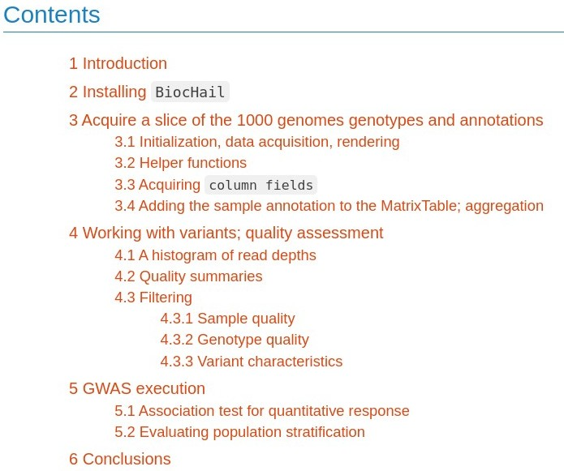
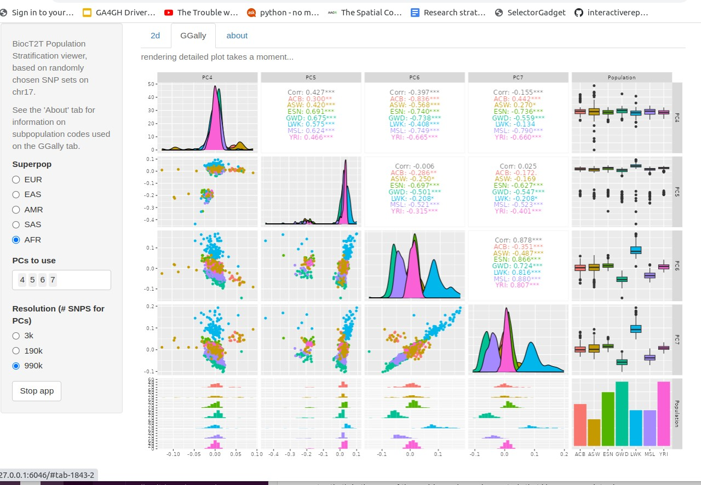

## Purpose

Provide general access to use cases for a transition to cloud
computing for a research lab focused on lung disease genetics
and personalized genomic medicine

See the "Get started" and "Articles" tabs above for details.  As a taster, we have

### Carey group

#### BiocHail

We have an R package in Bioconductor that runs through the following
topics (this is just a screenshot, visit [BiocHail at Bioconductor](http://bioconductor.org/packages/release/bioc/vignettes/BiocHail/inst/doc/gwas_tut.html) for the real thing in
at Bioconductor for details):

#### BiocT2T

We want to accelerate adoption of the new telomere-to-telomere
genome reference.  To get the flavor we have an app that looks like:

Full details at VJC's [pkgdown site](https://vjcitn.github.io/BiocT2T)

<!--

See the Articles tab for full details.  Here are some tasters:

## BiocHail 

This is only a snapshot of a hail.is curriculum ... see [BiocHail](http://bioconductor.org/packages/release/bioc/vignettes/BiocHail/inst/doc/gwas_tut.html) for the real thing in
Bioconductor

## BiocT2T

Install vjcitn/BiocT2T to use the stratapp function to investigate population
stratification

 
-->
