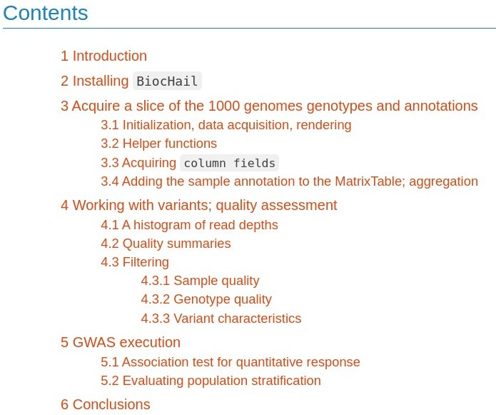

```{r setup,echo=FALSE,results="hide", message=FALSE}
library(BiocStyle)
```

# Purpose

Provide general access to use cases for a transition to cloud
computing for a research lab focused on lung disease genetics
and personalized genomic medicine

See the "Articles" tab for details.  To get the flavor
of test projects, we have

## Carey group

### BiocHail

We have an R package in Bioconductor that runs through the following
topics (this is just a screenshot, visit `r Biocpkg("BiocHail")` 
at Bioconductor for details):



Project activity: Log into cloud instance, start Rstudio, work with
BiocHail without user-level installation.  Requires access to a
6GB Hail MatrixTable, preferably shared.  Objective: Should we
use MatrixTables and their annotation to represent our GWAS?

### BiocT2T

We want to accelerate adoption of the new telomere-to-telomere
genome reference.  To get the flavor we have an app that looks like:


Full details at VJC's [pkgdown site](https://vjcitn.github.io/BiocT2T)

Project activity: Log into cloud instance, start Rstudio, work with
variants in the T2T calls of 3202 1000 genomes samples.  Subset to
samples with transcriptomic data in GEUVADIS and with DNAse-seq
data from Degner 2012 (or updated material on similar topics).
Objective: Does the higher-resolution genotyping lead to new insights on
molecular QTLs?
